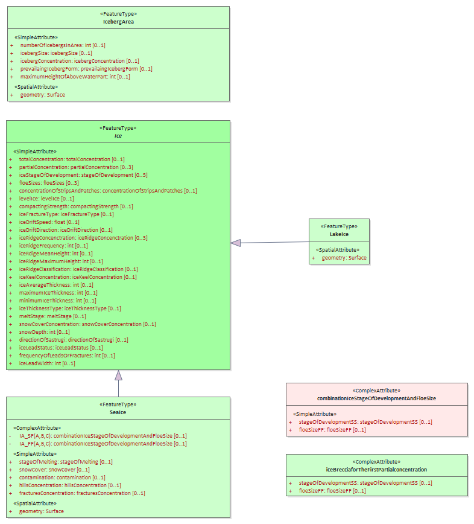
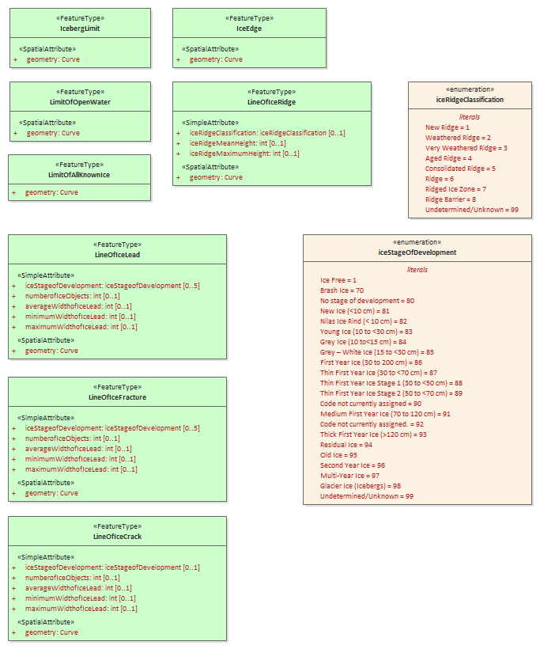

[[sec-data-content-and-structure]]
== Data Content and Structure

=== Introduction

The S-411 product is based on the S-100 General Feature Model (GFM), and is a feature-based vector product. Figure 4.1 shows how the S-411 application schema is realised from the S-100 GFM. All S-411 feature classes are derived from the abstract class FeatureType defined in the S-411 application schema, which realize the GFM meta-classes S100_GF_FeatureType.

The application schema of Ice Information product contains 28 feature types with their attributes, enumerations etc. It is based on the ice objects catalogue (Version 5.3) and can also be found in the ICE domain of the IHO Registry. Because of this it is not possible to describe full schema in suitable form in this specification. The full schema can be found as XML Schema File in Annex B – Data Product format (encoding).

#_Figure to be inserted, based on S-131  Figure 4.1_#

=== Application Schema

S-411 conforms to the General Feature Model (GFM) from S-100 Part 3. The GFM is the conceptual model and the 
implementation is defined in the Feature Catalogue which is included as a separate Annex (Annex C) and provides a full specification of all types including feature types, their attributes, allowed and values. The S-411 Product Specification only contains specific examples.

The following conventions are used in the UML diagrams depicting the application schema:

* Standard UML conventions for classes, associations, inheritance, roles, and multiplicities apply. These conventions are described in Part 1 of S-100.

* Italic font for a class name indicates an abstract class.

* Feature classes are depicted with green background; the dark shade for abstract feature classes and the light shade for ordinary (non-abstract) feature classes.

* Complex attributes are depicted with a pink background.

* Enumeration lists and codelists are depicted with a tan background. The numeric code corresponding to each listed value is shown to its right following an ‘=’ sign.

The diagram below shows a very simplified summary of the ice data structure.

#*Suggest deleting the figure below*#

[[fig-ice-data-product-structure]]
.*: Ice Data Product Structure*
image::../images/figure-ice-data-product-structure.png[UML diagram depicting the Application Schema Data Set Structure]

==== Domain model
The S-411 domain model has one base classe (‘root classe’) from which all the domain-specific geographic features type classes are derived. The base classe is shown in Figure 4.2 below. The base class for geographic features is FeatureType which has a set of attributes which are therefore inherited by all domain-specific features. The approximate area features in S-411 are also derived from the geographic feature root class. Both base classes are abstract classes and do not have direct instances in S-411 data – instead, S-411 feature type data objects are instantiations of a non-abstract class.

S-411 meta-feature is derived from the base classe – S-411 instead incorporates meta-feature definition originally prepared for S-101 in the interests of harmonization and interoperability with other S-100-based data products, especially S-101 ENCs.

#_Figure to be inserted, based on S-131  Figure 4.21_#

==== S-411 Features

===== Meta Features
S-411 provides a single meta-feature, *DataCoverage*. *DataCoverage* is for describing areas in the dataset that are populated with data. The dataset may include multiple *DataCoverage* features to describe different contiguous (i.e. non-overlapping) areas.

#_Figure to be inserted, based on S-131  Figure 4.2_#

===== Geographic Features

Geographic (geo) feature types form the principal content of the S-411 product and are fully defined by their associated attributes.

The following figure shows all the major ice features and a simplified view of their attributes in the S-411 Application Schema

[[fig-all-ice-features]]
.*All Ice Features*

Limit and Line curve features and their attributes are shown in the following diagram
[[fig-all-curve-features]]
.*All Curve Features*

Full details of all geographic feature types can be found in Annex A – Data Classification and Encoding Guide, clause 2.1 and Sections 4-22.

==== Attributes

S-411 defines attributes as either simple or complex.

===== Simple attributes

S-411 uses 3 types of simple attributes; these types are listed in Annex A – Data Classification and Encoding Guide, clause 2.4.2. Descriptions of the simple attributes included in S-101 can be found in Annex A, Sections 27, 28 and 30.

===== Complex attributes

Complex attributes are aggregations of other attributes that are either simple or complex. The aggregation is defined by means of attribute bindings. Examples of modelling complex attributes can be found in S-100 Part 2a, Appendix 2a-A. Descriptions of the complex attributes included in S-411 can be found in Annex A – Data Classification and Encoding Guide, Section 29.

_description of use of complex attributes in S-411_

=== Feature Catalogue

==== Introduction

The S-411 Feature Catalogue describes the feature types, attributes and attribute values which may be used in an S-411 product.

The S-411 Feature Catalogue is available in an XML document which conforms to the S-100 XML Feature Catalogue Schema and can be downloaded from the IHO website (https://registry.iho.int/). S-411 Annex A – Data Classification and Encoding Guide, constitutes a human readable interpretation of the Feature Catalogue.

The feature Catalogue for Ice Information contains only geographic and meta features. The ice features which can be used in ECDIS are fully presented in the ICE domain of the IHO Registry.

==== Feature types

Feature types contain descriptive attributes that characterize real-world entities. The word ‘feature’ may be used in one of two senses – feature type and feature instance. A feature type is a class and is defined in a Feature Catalogue. A feature instance is a single occurrence of the feature type and represented as an object in a dataset. A feature instance is located by a relationship to one or more spatial instances. A feature instance may exist without referencing a spatial instance.

==== Geographic

Geographic (geo) feature types carry the descriptive characteristics of a real-world entity (a location or place on the surface of the Earth). In the context of Ice Information products, this includes the ...

==== Meta

*Text to be added*

==== Attributes

S-411 defines attributes as either simple or complex.

===== Simple attributes

S-411 uses three types of simple attributes; they are listed in the following Table:

[cols="a,a",options="headers"]
|===
|Type |Definition 

|Integer
|An integer number.

|Real
|A floating point number.

|Enumeration
|One #*or more?*# of a list of predefined values.

|===

==== Application Schema implementation classes

===== Implementation classes description

[[fig-ice-app-schema-types]]
.*: Ice Application Schema Types*
image::../images/figure-ice-app-schema-types.png[UML diagram depicting the Application Schema Data Set Structure]

#*I would suggest deleting the following table - there are no associations in S-411*#

[cols="a,a,a,a, ",options="headers"]
|===
|Role Name |Name |Description |Mult. |Data Type

|Class
|IceDataSet
|Set of ice data
|-
|IceDataSetType

|Association
|IceFeatureMember
|Contains ice feature members
|1..*
|IceFeatureMemberType

|===

===== IceDataSet / Types

====== IceDataSetType

_IceDataSetType_ is a type of root Element of an ice information data set.

[[fig-ice-data-set-type]]
.*: Ice Data Set Type*
image::../images/figure-ice-data-set-type.png[UML diagram depicting the Ice Data Set structure]

Ice Data Set contains an unlimited number of Ice Feature Members, each Ice Feature Member contains one Ice Feature (seaice, lacice, iceberg, etc.).

#*I would suggest deleting the existing figures in the current PS*#

===== seaiceType (Sea Ice)

[[fig-sea-ice-type-sea-ice]]
.*: Sea Ice Type Sea Ice*
image::../images/figure-sea-ice-type-sea-ice.png[UML diagram depicting the Sea Ice Type]

===== laciceType (Lake Ice)

[[fig-lake-ice-type-lake-ice]]
.*: Lake Ice Type Lake Ice*
image::../images/figure-lake-ice-type-lake-ice.png[UML diagram depicting the Lake Ice Type]

===== brgareType (Iceberg Area)

[[fig-brgare-type-iceberg-area]]
.*: Brgare Type Iceberg Area*
image::../images/figure-brgare-type-iceberg-area.png[UML diagram depicting the brgare Type]

===== icelneType (Ice Edge)

[[fig-icelne-type-ice-edge]]
.*: Icelne Type Ice Edge*
image::../images/figure-icelne-type-ice-edge.png[UML diagram depicting the icelne Type]

===== brglne Type (Iceberg Limit)

[[fig-brglne-type-iceberg-limit]]
.*: Brglne Type Iceberg Limit*
image::../images/figure-brglne-type-iceberg-limit.png[UML diagram depicting the brglne Type]

===== opnlne Type (Limit of Open Water)

[[fig-opnlne-type-limit-of-open-water]]
.*: Opnlne Type Limit Of Open Water*
image::../images/figure-opnlne-type-limit-of-open-water.png[UML diagram depicting the opnlne Type]

===== lkilne Type (Limit of All Known Ice)

[[fig-lkilne-type-limit-of-all-known-ice]]
.*: Opnlne Type Limit of All Known Ice*
image::../images/figure-lkilne-type-limit-of-all-known-ice.png[UML diagram depicting the lkilne Type]

===== i_ridg Type (Line of Ice Ridge)

[[fig-i_ridg-type-line-of-ice-ridge]]
.*: i_ridg Type Line Of Ice Ridge*
image::../images/figure-i_ridg-type-line-of-ice-ridge.png[UML diagram depicting the i_ridg Type]

===== i_lead Type (Line of Ice Lead)

[[fig-i_fral-type-line-of-ice-lead]]
.*: i_lead Type Line Of Ice Lead*
image::../images/figure-i_lead-type-line-of-ice-lead.png[UML diagram depicting the i_lead Type]

===== i_fral Type (Line of Ice Fracture)

[[fig-i_fral-type-line-of-ice-fracture]]
.*: i_fral Type Line Of Ice Fracture*
image::../images/figure-i_fral-type-line-of-ice-fracture.png[UML diagram depicting the i_fral Type]

===== i_crac Type (Line of Ice Crack)

[[fig-i_crac-type-line-of-ice-crack]]
.*: i_crac Type Line Of Ice Crack*
image::../images/figure-i_fral-type-line-of-ice-fracture.png[UML diagram depicting the i_crac Type]

===== icecom Type (Ice Compacting)

[[fig-icecom-type-ice-compacting]]
.*: icecom Type Ice Compacting*
image::../images/figure-icecom-type--ice-compacting.png[UML diagram depicting the icecom Type]

===== icelea Type (Ice Lead)

[[fig-icelea-type-ice-lead]]
.*: icelea Type Ice Lead*
image::../images/figure-icelea-type-ice-lead.png[UML diagram depicting the icelea Type]

===== icebrg Type (Iceberg)

[[fig-icebrg-type-iceberg]]
.*: icebrg Type Iceberg*
image::../images/figure-icebrg-type-iceberg.png[UML diagram depicting the icebrg Type]

===== flobrg Type (Floeberg)

[[fig-flobrg-type-floeberg]]
.*: flobrg Type Floeberg*
image::../images/figure-flobrg-type-floeberg.png[UML diagram depicting the flobrg Type]

===== icethk Type (Ice Thickness)

[[fig-icethk-type-ice-thickness]]
.*: icethk Type Ice Thickness*
image::../images/figure-icethk-type-ice-thickness.png[UML diagram depicting the icethk Type]

===== iceshr Type (Ice Shear)

[[fig-iceshr-type-ice-shear]]
.*: iceshr Type Ice Shear*
image::../images/figure-iceshr-type-ice-shear.png[UML diagram depicting the iceshr Type]

===== icediv Type (Ice Divergence)

[[fig-icediv-type-ice-divergence]]
.*: icediv Type Ice Divergence*
image::../images/figure-icediv-type-ice-divergence.png[UML diagram depicting the icediv Type]

===== icerdg Type (Ice Ridge/Hummock)

[[fig-icerdg-type-ice-ridge/hummock]]
.*: icerdg Type Ice Ridge/Hummock*
image::../images/figure-icerdg-type-ice-ridge.png[UML diagram depicting the icerdg Type]

===== icekel Type (Ice Keel/Bummock)

[[fig-icekel-type-ice-keel-bummock]]
.*: icerdg Type Ice Keel/Bummock*
image::../images/figure-icekel-type-ice-keel-bummock.png[UML diagram depicting the icekel Type]

===== icedft Type (Ice Drift)

[[fig-icedft-type-ice-drift]]
.*: icedft Type Ice Drift*
image::../images/figure-icedft-type-ice-drift.png[UML diagram depicting the icedft Type]

===== icefra Type (Ice Fracture)

[[fig-icefra-type-ice-fracture]]
.*: icefra Type Ice Fracture*
image::../images/figure-icefra-type-ice-fracture.png[UML diagram depicting the icefra Type]

===== icerft Type (Ice Rafting)

[[fig-icerft-type-ice-rafting]]
.*: icerft Type Ice Rafting*
image::../images/figure-icerft Type Ice Rafting.png[UML diagram depicting the icerft Type]

===== jmdbrr Type (Jammed Brash Barrier)

[[fig-jmdbrr-type-jammed-brash-barrier]]
.*: jmdbrr Type Jammed Brash Barrier*
image::../images/figure-jmdbrr-type-jammed-brash-barrier.png[UML diagram depicting the jmdbrr Type]

===== stgmlt Type (Stage of Melt)

[[fig-stgmlt-type-stage-of-melt]]
.*: stgmlt Type Stage of Melt*
image::../images/figure-stgmlt-type-stage-of-melt.png[UML diagram depicting the stgmlt Type]

===== snwcvr Type (Snow Cover)

[[fig-snwcvr-type-snow-cover]]
.*: snwcvr Type Snow Cover*
image::../images/figure-snwcvr-type-snow-cover.png[UML diagram depicting the snwcvr Type]

===== strptc Type (Strips and Patches)

[[fig-strptc-type-strips-and-patches]]
.*: strptc Type Strips and Patches*
image::../images/figure-strptc-type-strips-and-patches.png[UML diagram depicting the strptc Type]

===== i_grhm Type (Grounded Hummock)

[[fig-i_grhm-type-grounded-hummock]]
.*: i_grhm Type Grounded Hummock*
image::../images/figure-i_grhm-type-grounded-hummock.png[UML diagram depicting the i_grhm Type]

==== Feature Types Summary

. Summary of Types
[cols="a,a,a,a",options="headers"]
|===
|Register Dictionary |Index |Alpha code |Name

|IceFCD
|Feature
|SEAICE
|Sea Ice

|IceFCD
|Feature
|LACICE
|Lake Ice

|IceFCD
|Feature
|BRGARE
|Iceberg Area

|IceFCD
|Feature
|ICELNE
|Ice Edge

|IceFCD
|Feature
|BRGLNE
|Iceberg Limit

|IceFCD
|Feature
|OPNLNE
|Limit of Open Water

|IceFCD
|Feature
|LKILNE
|Limit of All Known Ice

|IceFCD
|Feature
|I_RIDG
|Line of Ice Ridge

|IceFCD
|Feature
|I_LEAD
|Line of Ice Lead

|IceFCD
|Feature
|I_FRAL
|Line of Ice Fracture

|IceFCD
|Feature
|I_CRAC
|Line of Ice Crack

|IceFCD
|Feature
|ICECOM
|Ice Compacting

|IceFCD
|Feature
|ICELEA
|Ice Lead

|IceFCD
|Feature
|ICEBRG
|Iceberg

|IceFCD
|Feature
|FLOBRG
|Floeberg

|IceFCD
|Feature
|ICETHK
|Ice Thickness

|IceFCD
|Feature
|ICESHR
|Ice Shear

|IceFCD
|Feature
|ICEDIV
|Ice Divergence

|IceFCD
|Feature
|ICERDG
|Ice Ridge/Hummock

|IceFCD
|Feature
|ICEKEL
|Ice Keel/Bummock

|IceFCD
|Feature
|ICEDFT
|Ice Drift

|IceFCD
|Feature
|ICEFRA
|Ice Fracture

|IceFCD
|Feature
|ICERFT
|Ice Rafting

|IceFCD
|Feature
|JMDBRR
|Jammed Brash Barrier

|IceFCD
|Feature
|STGMLT
|Stage of Melt

|IceFCD
|Feature
|SNWCVR
|Snow Cover

|IceFCD
|Feature
|STRPTC
|Strips and Patches

|IceFCD
|Feature
|I_GRHM
|Grounded Hummock

|IceFCD
|Attribute
|ICEACT
|Total Concentration

|IceFCD
|Attribute
|ICEAPC
|Partial Concentration

|IceFCD
|Attribute
|ICESOD
|Ice Stage of Development

|IceFCD
|Attribute
|ICELSO
|Lake Ice Stage of Development

|IceFCD
|Attribute
|ICEFLZ
|Floe Sizes

|IceFCD
|Attribute
|ICEMLT
|Melt Stage

|IceFCD
|Attribute
|ICESPC
|Concentration of Strips and Patches

|IceFCD
|Attribute
|ICEBNM
|Number of Icebergs in Area

|IceFCD
|Attribute
|ICELVL
|Level Ice

|IceFCD
|Attribute
|ICECST
|Compacting Strength

|IceFCD
|Attribute
|ICEFTY
|Ice Fracture Type

|IceFCD
|Attribute
|ICELST
|Ice Lead Status

|IceFCD
|Attribute
|ICELFQ
|Frequency of Leads or Fractures

|IceFCD
|Attribute
|ICELOR
|Orientation of Leads or Fractures

|IceFCD
|Attribute
|ICELWD
|Ice Lead (or Fracture or Crack) Width

|IceFCD
|Attribute
|ICELOC
|Ice Location Information

|IceFCD
|Attribute
|ICEBSZ
|Iceberg Size

|IceFCD
|Attribute
|ICEDDR
|Ice Drift Direction

|IceFCD
|Attribute
|ICEDSP
|Ice Drift Speed

|IceFCD
|Attribute
|ICETCK
|Ice Average Thickness

|IceFCD
|Attribute
|ICEMAX
|Maximum Ice Thickness

|IceFCD
|Attribute
|ICEMIN
|Minimum Ice Thickness

|IceFCD
|Attribute
|ICETTY
|Ice Thickness Type

|IceFCD
|Attribute
|ICESCT
|Snow Depth

|IceFCD
|Attribute
|ICESCN
|Snow Cover Concentration

|IceFCD
|Attribute
|ICEDOS
|Direction Of Sastrugi

|IceFCD
|Attribute
|ICERCN
|Ice Ridge Concentration

|IceFCD
|Attribute
|ICERDV
|Ice Ridge Classification

|IceFCD
|Attribute
|ICERMH
|Ice Ridge Mean Height

|IceFCD
|Attribute
|ICERFQ
|Ice Ridge Frequency

|IceFCD
|Attribute
|ICERXH
|Ice Ridge Maximum Height

|IceFCD
|Attribute
|ICEKCN
|Ice Keel Concentration

|IceFCD
|Attribute
|ICEKFQ
|Ice Keel Frequency

|IceFCD
|Attribute
|ICEKMD
|Ice Keel Mean Depth

|IceFCD
|Attribute
|ICEKXD
|Ice Keel Maximum Depth

|IceFCD
|Attribute
|ICEFCN
|Ice Rafting Concentration

|IceFCD
|Attribute
|IA_SFA
|Ice Stage of Development and Floe Size for the 1st p.c.

|IceFCD
|Attribute
|IA_SFB
|Ice Stage of Development and Floe Size for the 2nd p.c.

|IceFCD
|Attribute
|IA_SFC 
|Ice Stage of Development and Floe Size for the 3rd p.c.

|IceFCD
|Attribute
|IA_FFA
|Ice Breccia for the 1st partial concentration

|IceFCD
|Attribute
|ICEFCN
|Ice Breccia for the 2nd partial concentration

|IceFCD
|Attribute
|IA_FFC
|Ice Breccia for the 3rd partial concentration

|IceFCD
|Attribute
|IA_SNG
|Snow concentration

|IceFCD
|Attribute
|IA_MLT
|Stage of melting

|IceFCD
|Attribute
|IA_PLG
|Contamination

|IceFCD
|Attribute
|IA_HLG
|Hills concentration

|IceFCD
|Attribute
|IA_DUG
|Fractures concentration

|IceFCD
|Attribute
|IA_BCN
|Icebergs concentration

|IceFCD
|Attribute
|IA_BFM
|Prevailing iceberg form

|IceFCD
|Attribute
|IA_BUH
|Max. height of the above-water part (iceberg / grounded hummock)

|IceFCD
|Attribute
|IA_OBN
|Number of ice objects

|IceFCD
|Attribute
|IA_DXW
|Max. width of ice lead (or fracture or crack)

|IceFCD
|Attribute
|IA_DMW
|Min. width of ice lead (or fracture or crack)

|IceFCD
|Attribute
|ICEBRS
|Brash Ice

|===
