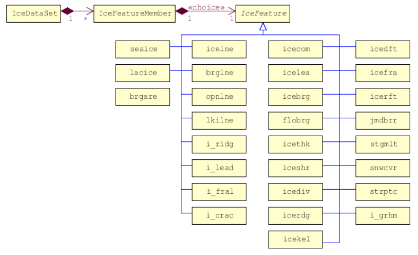
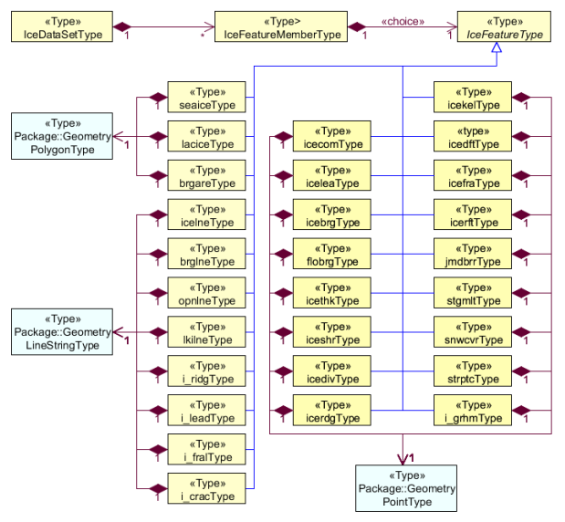
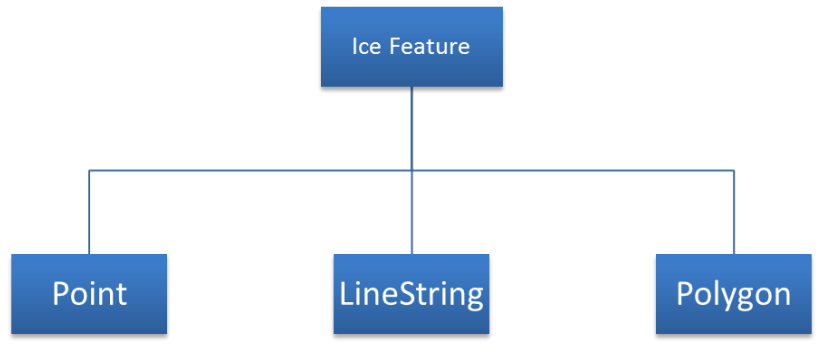

[[sec-data-content-and-structure]]
== Data Content and Structure

=== Introduction

The application schema of ice information product contains 28 feature types with their attributes, enumerations etc. It is based on the ice objects catalogue (Version 5.1) and can also be found in the ICE domain of the IHO Registry. Because of this it is not possible to describe full schema in suitable form in this specification. The full schema can be found as XML Schema File in Annex B – Data Product format (encoding).

=== Application Schema

_The following paragraph has been added based on S-101PS. TBC by GCOMM-ETSI_

S-411 conforms to the General Feature Model (GFM) from S-100 Part 3. The GFM is the conceptual model and the 
implementation is defined in the Feature Catalogue. The S-411 Application Schema is realised in the Feature Catalogue and the Product Specification only contains specific examples.

Picture below shows very simplified structure of ice data structure.

[[fig-ice-data-product-structure]]
.*: Ice Data Product Structure*

General GML (XML) representation:

[source,xml]
----
<?xml version="1.0" encoding="UTF-8"?>
<ice:IceDataSet xmlns:ice="http://www.iho.int/ice"
                xmlns:gml=http://www.opengis.net/gml/3.2>
    <ice:IceFeatureMember>
        <ice:seaice>
            <ice:iceact> … </ice:iceact>
            . 
            . 
            <gml:Polygon srsName="..">… </gml:Polygon>
        </ice:seaice>
</ice:IceMember>
<ice:IceMember>
    <ice:i_ridg>
        <ice:icerdv> … </ice:icerdv>
        . 
        .
        <gml:LineString srsName="..">… </gml:LineString>
    </ice:i_ridg>
</ice:IceMember>
<ice:IceMember>
    <ice:icebrg>
        <ice:icebsz> … </ice:icebsz>
        .
        .
        <gml:Point srsName="..">… </gml:Point>
    </ice:icebrg>
</ice:IceFeatureMember>
----

=== Feature Catalogue

==== Introduction

_Text in italic below has been added based on S-101 PS. TBC by JCOMM-ETSI._

_The S-411 Feature Catalogue describes the feature types, attributes, attribute values, associations and roles which may be used in an S-411 product._

The feature Catalogue for Ice Information contains only geographic features. The ice features which can be used in ECDIS are fully presented in the ICE domain of the IHO Registry.

_The S-411 Feature Catalogue is available in an XML document which conforms to the S-100 XML Feature Catalogue Schema and can be downloaded from the IHO website. S-411 Annex A – Data Classification and Encoding Guide, constitutes a human readable interpretation of the Feature Catalogue._

==== Application Schema implementation classes

===== Implementation classes description

[[fig-ice-app-schema-types]]
.*: Ice Application Schema Types*

_I would suggest moving the following table to the DCEG (and adpat to the DCEG format)_

[cols="a,a,a,a, ",options="headers"]
|===
|Role Name |Name |Description |Mult. |Data Type

|Class
|IceDataSet
|Set of ice data
|-
|IceDataSetType

|Association
|IceFeatureMember
|Contains ice feature members
|1..*
|IceFeatureMemberType

|===

===== IceDataSet / Types

====== IceDataSetType

_IceDataSetType_ is a type of root Element of an ice information data set.

[[fig-ice-data-set-type]]
.*: Ice Data Set Type*
image::../images/figure-ice-data-set-type.png[UML diagram depicting the Ice Data Set structure]

Ice Data Set contains an unlimited number of Ice Feature Members, each Ice Feature Member contains one Ice Feature (seaice, lacice, iceberg, etc.).

===== seaiceType (Sea Ice)

[[fig-sea-ice-type-sea-ice]]
.*: Sea Ice Type Sea Ice*
image::../images/figure-sea-ice-type-sea-ice.png[UML diagram depicting the Sea Ice Type]

===== laciceType (Lake Ice)

[[fig-lake-ice-type-lake-ice]]
.*: Lake Ice Type Lake Ice*
image::../images/figure-lake-ice-type-lake-ice.png[UML diagram depicting the Lake Ice Type]

===== brgareType (Iceberg Area)

[[fig-brgare-type-iceberg-area]]
.*: Brgare Type Iceberg Area*
image::../images/figure-brgare-type-iceberg-area.png[UML diagram depicting the brgare Type]

===== icelneType (Ice Edge)

[[fig-icelne-type-ice-edge]]
.*: Icelne Type Ice Edge*
image::../images/figure-icelne-type-ice-edge.png[UML diagram depicting the icelne Type]

===== brglne Type (Iceberg Limit)

[[fig-brglne-type-iceberg-limit]]
.*: Brglne Type Iceberg Limit*
image::../images/figure-brglne-type-iceberg-limit.png[UML diagram depicting the brglne Type]

===== opnlne Type (Limit of Open Water)

[[fig-opnlne-type-limit-of-open-water]]
.*: Opnlne Type Limit Of Open Water*
image::../images/figure-opnlne-type-limit-of-open-water.png[UML diagram depicting the opnlne Type]

===== lkilne Type (Limit of All Known Ice)

[[fig-lkilne-type-limit-of-all-known-ice]]
.*: Opnlne Type Limit of All Known Ice*
image::../images/figure-lkilne-type-limit-of-all-known-ice.png[UML diagram depicting the lkilne Type]

===== i_ridg Type (Line of Ice Ridge)

[[fig-i_ridg-type-line-of-ice-ridge]]
.*: i_ridg Type Line Of Ice Ridge*
image::../images/figure-i_ridg-type-line-of-ice-ridge.png[UML diagram depicting the i_ridg Type]

===== i_lead Type (Line of Ice Lead)

[[fig-i_fral-type-line-of-ice-lead]]
.*: i_lead Type Line Of Ice Lead*
image::../images/figure-i_lead-type-line-of-ice-lead.png[UML diagram depicting the i_lead Type]

===== i_fral Type (Line of Ice Fracture)

[[fig-i_fral-type-line-of-ice-fracture]]
.*: i_fral Type Line Of Ice Fracture*
image::../images/figure-i_fral-type-line-of-ice-fracture.png[UML diagram depicting the i_fral Type]

===== i_crac Type (Line of Ice Crack)

[[fig-i_crac-type-line-of-ice-crack]]
.*: i_crac Type Line Of Ice Crack*
image::../images/figure-i_fral-type-line-of-ice-fracture.png[UML diagram depicting the i_crac Type]

===== icecom Type (Ice Compacting)

[[fig-icecom-type-ice-compacting]]
.*: icecom Type Ice Compacting*
image::../images/figure-icecom-type--ice-compacting.png[UML diagram depicting the icecom Type]

===== icelea Type (Ice Lead)

[[fig-icelea-type-ice-lead]]
.*: icelea Type Ice Lead*
image::../images/figure-icelea-type-ice-lead.png[UML diagram depicting the icelea Type]

===== icebrg Type (Iceberg)

[[fig-icebrg-type-iceberg]]
.*: icebrg Type Iceberg*
image::../images/figure-icebrg-type-iceberg.png[UML diagram depicting the icebrg Type]

===== flobrg Type (Floeberg)

[[fig-flobrg-type-floeberg]]
.*: flobrg Type Floeberg*

===== icethk Type (Ice Thickness)

[[fig-icethk-type-ice-thickness]]
.*: icethk Type Ice Thickness*

===== iceshr Type (Ice Shear)

[[fig-iceshr-type-ice-shear]]
.*: iceshr Type Ice Shear*
image::../images/figure-iceshr-type-ice-shear.png[UML diagram depicting the iceshr Type]

===== icediv Type (Ice Divergence)

[[fig-icediv-type-ice-divergence]]
.*: icediv Type Ice Divergence*
image::../images/figure-icediv-type-ice-divergence.png[UML diagram depicting the icediv Type]

===== icerdg Type (Ice Ridge/Hummock)

[[fig-icerdg-type-ice-ridge/hummock]]
.*: icerdg Type Ice Ridge/Hummock*
image::../images/figure-icerdg-type-ice-ridge.png[UML diagram depicting the icerdg Type]

===== icekel Type (Ice Keel/Bummock)

[[fig-icekel-type-ice-keel-bummock]]
.*: icerdg Type Ice Keel/Bummock*
image::../images/figure-icekel-type-ice-keel-bummock.png[UML diagram depicting the icekel Type]

===== icedft Type (Ice Drift)

[[fig-icedft-type-ice-drift]]
.*: icedft Type Ice Drift*
image::../images/figure-icedft-type-ice-drift.png[UML diagram depicting the icedft Type]

===== icefra Type (Ice Fracture)

[[fig-icefra-type-ice-fracture]]
.*: icefra Type Ice Fracture*
image::../images/figure-icefra-type-ice-fracture.png[UML diagram depicting the icefra Type]

===== icerft Type (Ice Rafting)

[[fig-icerft-type-ice-rafting]]
.*: icerft Type Ice Rafting*
image::../images/figure-icerft Type Ice Rafting.png[UML diagram depicting the icerft Type]

===== jmdbrr Type (Jammed Brash Barrier)

[[fig-jmdbrr-type-jammed-brash-barrier]]
.*: jmdbrr Type Jammed Brash Barrier*
image::../images/figure-jmdbrr-type-jammed-brash-barrier.png[UML diagram depicting the jmdbrr Type]

===== stgmlt Type (Stage of Melt)

[[fig-stgmlt-type-stage-of-melt]]
.*: stgmlt Type Stage of Melt*
image::../images/figure-stgmlt-type-stage-of-melt.png[UML diagram depicting the stgmlt Type]

===== snwcvr Type (Snow Cover)

[[fig-snwcvr-type-snow-cover]]
.*: snwcvr Type Snow Cover*
image::../images/figure-snwcvr-type-snow-cover.png[UML diagram depicting the snwcvr Type]

===== strptc Type (Strips and Patches)

[[fig-strptc-type-strips-and-patches]]
.*: strptc Type Strips and Patches*
image::../images/figure-strptc-type-strips-and-patches.png[UML diagram depicting the strptc Type]

===== i_grhm Type (Grounded Hummock)

[[fig-i_grhm-type-grounded-hummock]]
.*: i_grhm Type Grounded Hummock*
image::../images/figure-i_grhm-type-grounded-hummock.png[UML diagram depicting the i_grhm Type]

==== Feature Types Summary

[cols="a,a,a, ",options="headers"]
|===
|Register Dictionary |Index |Alpha code |Name

|IceFCD
|Feature
|SEAICE
|Sea Ice

|IceFCD
|Feature
|LACICE
|Lake Ice

|===

_Table to be continued (if confirmed)_

===== Geographic

_Geographic (geo) feature types form the principal content of the S-411 product and are fully defined by their associated attributes.
Details of geographic feature types can be found in Annex A – Data Classification and Encoding Guide, clause 2.1 and Sections 4-22._

==== Attributes

S-411 defines attributes as either simple or complex.

===== Simple attributes

_S-411 uses 3 types of simple attributes; these types are listed in Annex A – Data Classification and Encoding Guide, clause 2.4.2. Descriptions of the simple attributes included in S-101 can be found in Annex A, Sections 27, 28 and 30._

===== Complex attributes

_Complex attributes are aggregations of other attributes that are either simple or complex. The aggregation is defined by means of attribute bindings. Examples of modelling complex attributes can be found in S-100 Part 2a, Appendix 2a-A. Descriptions of the complex attributes included in S-411 can be found in Annex A – Data Classification and Encoding Guide, Section 29._

=== Dataset types

==== Introduction

At the moment there is only one type of dataset supported. This is GML(XML) encoded ice feature collections.

=== Geometry

Ice Information datasets use S-100 Level 3a geometry which supports 0-, 1-, and 2-dimensional objects (points, line strings, and polygons).

[[fig-geometric-primitives-in-ice-information-product]]
.*: Geometric Primitives Ice Information Product*

There are three types of geometry: Point, Line String and Polygon. Multi-geometries will be not supported. The standard geometries of GML where redefined for S-411. The reason for this is to reduce file sizes. It is only possible to use “posList” with blanks separated coordinate values, like:

[source,xml]
----
<gml:posList>-73.991 40.736 -73.991 40.736</gml:posList>
----

For standard GML it would be also possible to use following (DO NOT USE THIS):
[source,xml]
----
<gml:posList>
  <pos>-73.991 40.736</pos>
  <pos>-73.991 40.736</pos>
</gml:posList>
----
Which means much more chars in the file and growing of file size.

All multi-geometries must be splitted into single geometries. Encoding for geometry is GML:

Point encoding example:
[source,xml]
----
  <gml:Point
    <gml:pos>147.291 -42.851</gml:pos>
  </gml:Point>
----

Line String encoding example:
[source,xml]
----
  <gml:LineString>
    <gml:posList>-73.991 40.736 -73.991 40.736</gml:posList>
</gml:LineString>
----

Polygon encoding example:
[source,xml]
----
<gml:Polygon>
  <gml:exterior>
    <gml:LinearRing>
      <gml:posList>
        22.546 62.391 25.033 62.404 24.995 60.182 22.483
        60.169 22.546 62.391
      </gml:posList>
    </gml:LinearRing>
</gml:exterior>
<gml:interior>
  <gml:LinearRing>
    <gml:posList>
      23.227 61.811 23.467 61.306 24.023 61.621 24.035
      61.621 23.227 61.811
    </gml:posList>
  </gml:LinearRing>
  </gml:interior>
</gml:Polygon>
----
