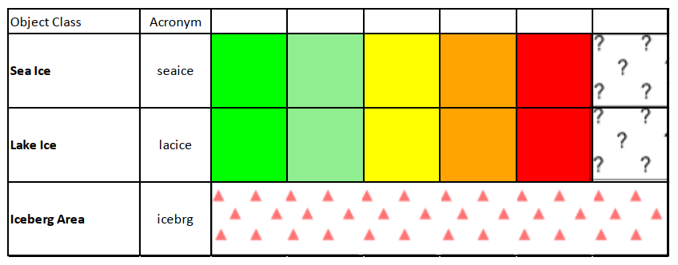
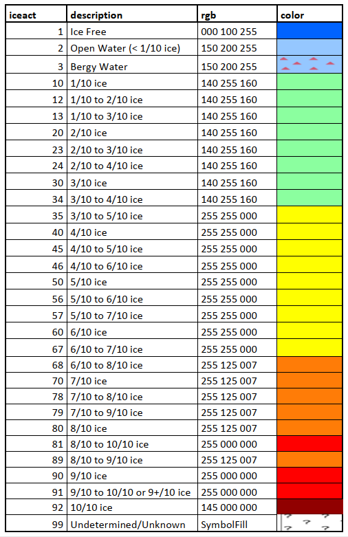
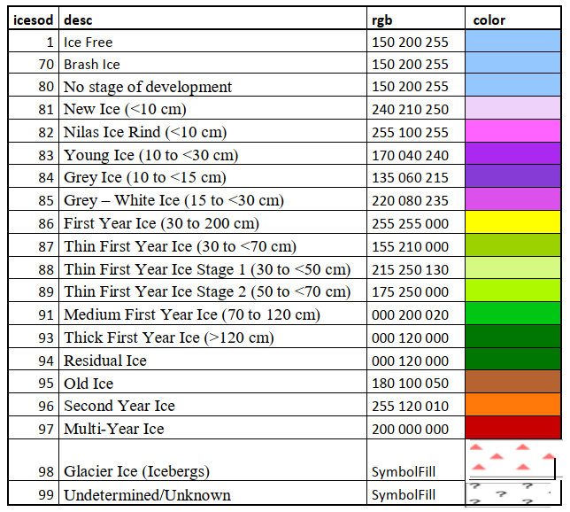
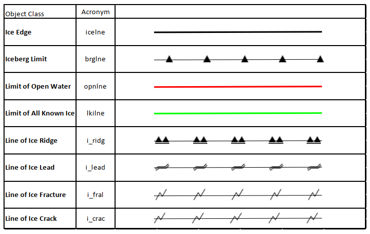

[[sec-portrayal]]
== Portrayal

=== Rules

[[fig-portrayal-rules]]
.*: Portrayal Rules*
image::../images/figure-portrayal-rules.png[UML diagram depicting the Portrayal Rules]

`main.xsl` includes all the rules for single feature types. It manages the selection of the right rule, depending on current feature type in `dataset and parameters in `iceDisplayParameters.xml`.

`iceDisplayParameters.xml` contains parameters important for display of ice features:

* String `iceclass`

* Boolean `encoverlay`

* String `Display Mode`

Depending on the `iceclass` parameter the right `seaice` or `lacice` rule can be selected. The default is `*_class_III.xsl`

The `encoverlay` parameter helps to calculate the priority for display of single ice feature types. If `encoverlay` is true, the priority will be calculated, depending on priority of land area feature in ENC. The area objects of ice features should be displayed under the land area polygons, because they are usually drawn over the land.

=== Symbols

==== Polygon Features

===== IceNavigationalDisplayMode (Traffic Light Principle, depends on Ice Class)

[[fig-ice-navigational-display-mode]]
.*: Ice Navigational Display Mode*

===== IceScientificIceactDisplayMode

[[fig-ice-scientific-lceact-display-mode]]
.*: Ice Scientific lceact Display Mode*

===== IceNavigationalDisplayMode

[[fig-ice-scientific-lcesod-display-mode]]
.*: Ice Scientific lcesod Display Mode*

==== Line Features

[[fig-line-features-portrayal]]
.*: Line Feautures Portrayal*

==== Point Features

[width="100%",cols="2,2,1"]
|===

|*Feature Class* |*Acronym* |*Symbol*

|Ice Compacting
|icecom
a|image::../../PC/Symbols/icecom.svg[]

|Ice Lead
|icelea
a|image::../../PC/Symbols/icelea.svg[]

|Ice Shear
|iceshr
a|image::../../PC/Symbols/iceshr.svg[]

|Ice Divergence
|icediv
a|image::../../PC/Symbols/icediv.svg[]

|Ice Ridge / Hummock
|icerdg
a|image::../../PC/Symbols/icerdg.svg[]

|Ice Keel / Bummock
|icekel
a|image::../../PC/Symbols/icekel.svg[]

|Ice Fracture
|flobrg
a|image::../../PC/Symbols/flobrg.svg[]

|Ice Rafting
|icerft
a|image::../../PC/Symbols/icerft.svg[]

|Jammed Brash Barrier
|jmdbrr
a|image::../../PC/Symbols/jmdbrr.svg[]

|Stage of Mell
|stgmlt
a|image::../../PC/Symbols/stgmlt.svg[]

|Snow Cover
|snwcvr
a|image::../../PC/Symbols/snwcvr.svg[]

|Strips and patches
|strptc
a|image::../../PC/Symbols/strptc.svg[]

|Grounded Hummock
|i_grhm
a|image::../../PC/Symbols/i_grhm.svg[]

|Iceberg
|icebrg
|

|
|icebrg 01 (Growler)
a|image::../../PC/Symbols/icebrg_growler.svg[]

|
|icebrg 02 (Bergy Bit)
a|image::../../PC/Symbols/icebrg_bergy_bit.svg[]

|
|icebrg 03 (Small Iceberg)
a|image::../../PC/Symbols/icebrg_small.svg[]

|
|icebrg 04 (Medium Iceberg)
a|image::../../PC/Symbols/icebrg_medium.svg[]

|
|icebrg 05 (Large Iceberg)
a|image::../../PC/Symbols/icebrg_large.svg[]

|
|icebrg 06 (Very Large Iceberg)
a|image::../../PC/Symbols/icebrg_very_large.svg[]

|
|icebrg 07 (Ice Island Fragment)
a|image::../../PC/Symbols/icebrg_ice_island_fragment.svg[]

|
|icebrg 08 (Ice Island)
a|image::../../PC/Symbols/icebrg_ice_island.svg[]

|
|icebrg 09 (Radar Target)
a|image::../../PC/Symbols/icebrg_radar_target.svg[]

|
|icebrg 99 (Unknown)
a|image::../../PC/Symbols/icebrg_unknown.svg[]

|Ice Drift
|icedft
|

|
|icedft 01 (No Ice Motion)
a|image::../../PC/Symbols/icedft_no_ice_motion.svg[]

|
|icedft 02 (NE)
a|image::../../PC/Symbols/icedft_NE.svg[]

|
|icedft 03 (E)
a|image::../../PC/Symbols/icedft_E.svg[]

|
|icedft 04 (SE)
a|image::../../PC/Symbols/icedft_SE.svg[]

|
|icedft 05 (S)
a|image::../../PC/Symbols/icedft_S.svg[]

|
|icedft 06 (SW)
a|image::../../PC/Symbols/icedft_NW.svg[]

|
|icedft 07 (W)
a|image::../../PC/Symbols/icedft_W.svg[]

|
|icedft 08 (NW)
a|image::../../PC/Symbols/icedft_NW.svg[]

|
|icedft 09 (N)
a|image::../../PC/Symbols/icedft_N.svg[]

|
|icedft 10 (Variable)
a|image::../../PC/Symbols/icedft_variable.svg[]

|
|icedft 99 (Unknown)
a|image::../../PC/Symbols/icedft_unknown.svg[]

|===

==== Draw order
The highest number will be drawn on the top.

[cols="a,a,a" ,options="headers"]
|===
|No |Name |Acronym

|1
|Sea Ice
|seacie

|1
|Lake Ice
|lacice

|2
|Iceberg Area
|seacie

|1
|Sea Ice
|icebrg

|3
|Ice Edge
|icelne

|4
|Iceberg Limit
|brglne

|5
|Limit of Open Water
|opnlne

|6
|Limit of All Known Ice
|lkilne

|7
|Line of Ice Ridge
|i_ridg

|8
|Line of Ice Lead
|i_lead

|9
|Line of Ice Fracture
|i_fral

|10
|Line of Ice Crack
|i_crac

|11
|Ice Compacting
|icecom

|12
|ce Lead
|icelea

|13
|Iceberg
|icebrg

|14
|Floeberg
|flobrg

|15
|Ice Thickness
|icethk

|16
|Ice Shea
|iceshr

|17
|Ice Divergence
|icediv

|18
|Ice Ridge / Hummock
|icerdg

|19
|Ice Keel / Bummock
|icekel

|20
|Ice Drift
|icedft

|21
|Ice Fracture
|icefra

|22
|Ice Rafting
|icerft

|23
|Jammed Brash Barrier
|jmdbrr

|24
|Stage of Melt
|stgmlt

|25
|Snow Cover
|snwcvr

|26
|Strips and Patches
|strptc

|27
|Grounded Hummock
|i_grhm

|===
