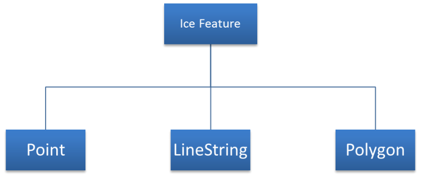

[[sec-datasets]]
== Datasets

=== Introduction

A dataset is a grouping of features, attributes, geometry and metadata which comprises a specific coverage.

=== Dataset Rules

In order to facilitate the efficient processing of S-411 data the geographic coverage of a given *maximum display* scale may be split into multiple datasets.

The discovery metadata of a dataset must list all the *Data Coverage* features contained within that dataset and their assigned scale attributions.

Datasets must not cross the 180° meridian; this includes both the *Data Coverage* features and the bounding box for the dataset.

=== Data Coverage rules

* All base datasets (new dataset, new edition) must contain at least one *Data Coverage* feature.
* The data boundary of the base dataset is defined by the extent of the *Data Coverage* features and must be contained within the bounding box.
* The *Data Coverage* features within a dataset must not overlap, however *Data Coverage* features from different datasets may overlap if they have differing *maximum display scales*.
* Datasets may overlap, however there must be no overlapping *Data Coverage* features of the same *maximum display scale*, except at the agreed adjoining national data limits, where, if it is difficult to achieve a perfect join, a 5 metre overlapping buffer zone may be used; and for this situation, there must be no gaps in data.
* When a dataset has multiple *Data Coverage* features, then the *minimum display scale* must be the same for all *Data Coverage* features within the dataset. The *maximum display scale* for multiple *Data Coverage* features within a dataset may be different.
* When a dataset has multiple *Data Coverage features* then the *maximum display scale* of the dataset must be equal to the largest *maximum display scale* of the *Data Coverage* features.
* The *maximum display scale* is considered to be the equivalent of the compilation scale of the data.

== Display Scale Range
A scale range of a dataset is used to indicate a range of scales between which a producer considers the data is intended for use. The smallest scale is defined by the *minimum display scale* and the largest scale by the *maximum display scale*. These scales must be set at one of the scales specified elsewhere in this product specification.

When the system’s viewing scale is smaller than the value indicated by *minimum display scale*, features within the *Data Coverage* feature are not displayed, except where the System Database does not contain a dataset covering the area at a smaller scale, in which case the dataset will be displayed at all smaller scales. When the viewing scale is larger than the value indicated by *maximum display scale*, an overscale indication must be shown.
#*Don't think this last clause applies to S-411*#

== Geometry

=== S-411 Geometry

S-411 Ice Information features are encoded as vector entities which conform to S-100 geometry configuration level 3a (S-100 clause 7-4.3).
Level 3a is described by the following constraints:

* Each curve must reference a start and end point (they may be the same).
* Curves must not self intersect. See S-100 Figure 7-5.
* Areas are represented by a closed loop of curves beginning and ending at a common point.
* In the case of areas with holes, all internal boundaries must be completely contained within the external boundary and the internal boundaries must not intersect each other or the external boundary. Internal boundaries may touch other internal boundaries or the external boundary tangentially (that is at one point) as shown in S-100 Figure 7-6.
* The outer boundary of a surface must be in a clockwise direction (surface to the right of the curve) and the curve orientation positive. The inner boundary of a surface must be in a counter-clockwise direction (surface to the right of the curve) and the curve orientation negative. See S-100 Figure 7-7.

S-411 further constrains Level 3a with the following:

* Linear geometry is defined by curves which are made of curve segments. Each curve segment contains the geographic coordinates as control points and defines an interpolation method between them. Coordinate density can have a significant impact on file size and system performance. A rule of thumb is to limit the coordinate density to 0.3 mm at maximum permitted display scale.
* For a scale-less product, the producer should keep in mind the expected scale range for typical use and the density of coordinates needed to suit the needs of the product.

[[fig-geometric-primitives-in-ice-information-product]]
.*Geometric Primitives Ice Information Product [REDRAW THIS DIAGRAM]*

